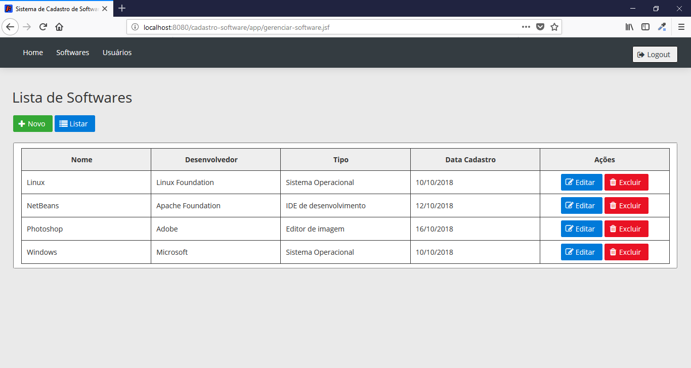
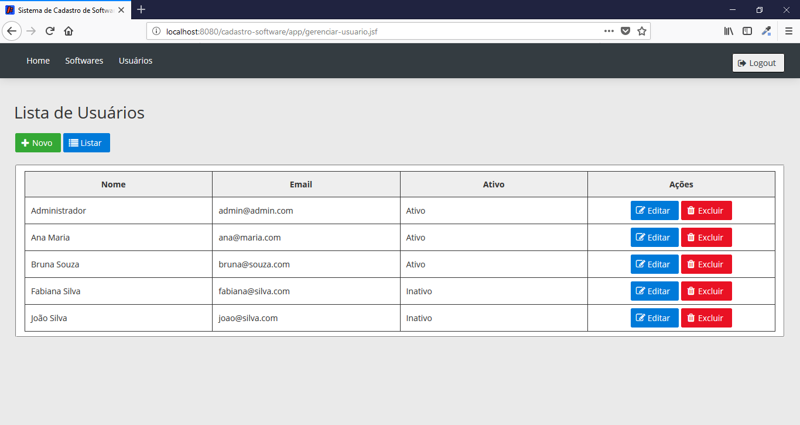
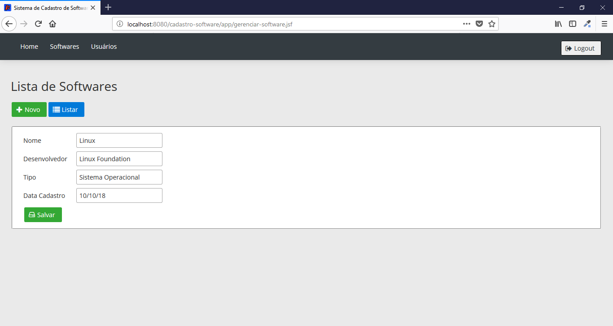
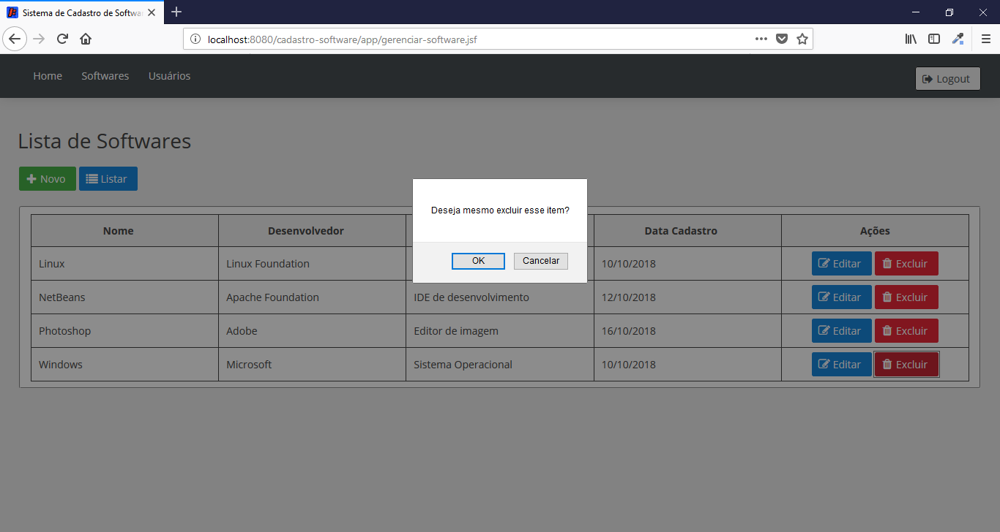

# Softwares

Projeto de cadastro de Software desenvolvido com Java Web, JSF e Maven.

## Características

- CRUD
- ORM
- EJB (Beans)
- DataTables
- Sort Column

## Requisitos

- NetBeans 8.2
- Java JDK 1.8
- Maven 3.5.4
- TomCat 9.0.12
- PostgreSQL 10

## Tecnologias

- Java
- JPA
- JSF
- Maven
- CSS
- JS
- PrimeFaces
- PostgreSQL

## Instalação

```
$ git clone https://github.com/danilomeneghel/cadastro-software.git

$ cd cadastro-software

```

Crie o banco de dados com o nome cadastro_software em seu PostgreSQL. Você pode localizar o dump cadastro_software.sql na raiz e importar com: 

```

$ psql -U <username> 

postgres> create database cadastro_software;
postgres> \q

$ pg_restore -U <username> -d cadastro_software -1 cadastro_software.sql

```

Após você finalizar a configuração, basta abrir o NetBeans e rodar o projeto e abrir em seu navegador.<br>
http://localhost:8080/cadastro-software/

## Repositório Maven

Search dependences Maven. <br>
https://mvnrepository.com/

## Licença

Projeto licenciado sob <a href="LICENSE">The MIT License (MIT)</a>.

## Screenshots

<br><br>
<br><br>
<br><br>
<br><br>
<br><br>
<br><br>